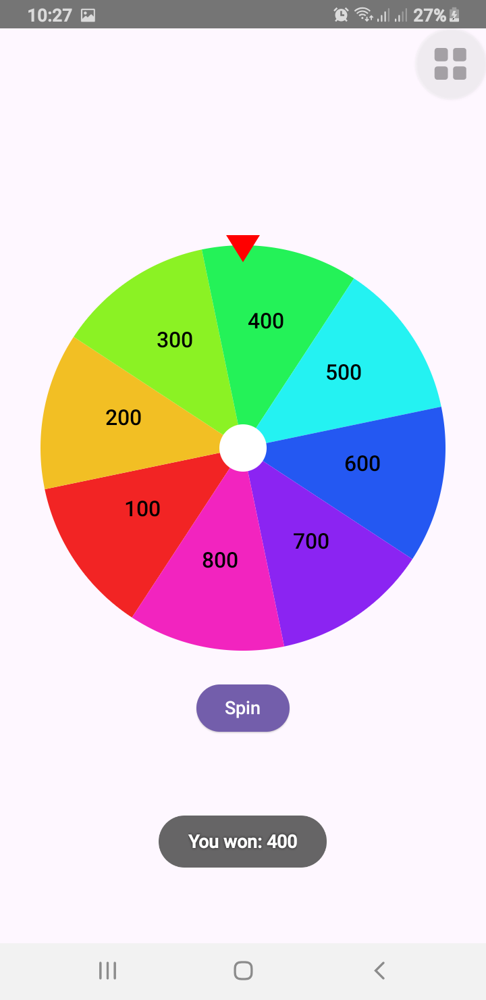

# 🎡 Wheel Spinner App – Android Java, Jetpack Compose & Flutter

A smooth and vibrant lucky **wheel spinner app** built using:
- Android **Java (Custom View)**
- Android **Jetpack Compose**
- Cross-platform **Flutter**

Perfect for games, giveaways, lucky draws, and random pickers!  
Simple to run, beginner-friendly code, and works across platforms.

🔗 **Get more source codes at:** [https://www.alsaeeddev.com](https://www.alsaeeddev.com)

⬇️ **[Download ZIP of this repository](https://github.com/alsaeeddev/spin-wheel-flutter-compose-java/archive/refs/heads/main.zip)**

---

## 📽️ Live Demo (YouTube Short)

---

## 📸 Screenshot

---

## 🚀 Features

- 🎯 Smooth spinning animation  
- 🎨 Auto-colored segments  
- 🧠 Callback on spin result  
- 🛠️ Three implementations included  
- ✅ Works on Android (Java & Compose) and Flutter (Android/iOS/Web)

---

## 📁 Included Projects

This repository includes a ZIP file with three complete **mini** source code projects:
- Java (Custom View)
- Jetpack Compose
- Flutter (cross-platform)

---
